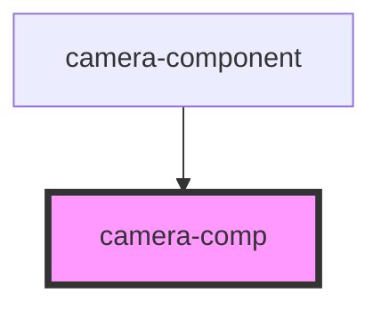

# camera-comp

<!-- Auto Generated Below -->

## Properties

| Property               | Attribute               | Description | Type      | Default     |
| ---------------------- | ----------------------- | ----------- | --------- | ----------- |
| `device`               | --                      |             | `Device`  | `undefined` |
| `faceDetection`        | `face-detection`        |             | `boolean` | `undefined` |
| `modelPath`            | `model-path`            |             | `string`  | `undefined` |
| `probabilityThreshold` | `probability-threshold` |             | `number`  | `undefined` |
| `showMask`             | `show-mask`             |             | `boolean` | `undefined` |

## Events

| Event          | Description | Type               |
| -------------- | ----------- | ------------------ |
| `closeCamera`  |             | `CustomEvent<any>` |
| `errorCamera`  |             | `CustomEvent<any>` |
| `makePhoto`    |             | `CustomEvent<any>` |
| `takePhoto`    |             | `CustomEvent<any>` |
| `videoStarted` |             | `CustomEvent<any>` |

## Dependencies

### Used by

 - [camera-component](../MainComponent)

### Graph

----------------------------------------------

*Built with [StencilJS](https://stenciljs.com/)*
