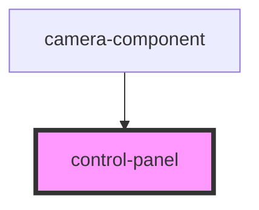

# control-panel

<!-- Auto Generated Below -->

## Properties

| Property              | Attribute               | Description | Type      | Default     |
| --------------------- | ----------------------- | ----------- | --------- | ----------- |
| `cameraStatus`        | `camera-status`         |             | `number`  | `undefined` |
| `disableControlPanel` | `disable-control-panel` |             | `boolean` | `undefined` |
| `faceDetection`       | `face-detection`        |             | `boolean` | `undefined` |
| `mobile`              | `mobile`                |             | `boolean` | `undefined` |
| `mobileMakePhoto`     | `mobile-make-photo`     |             | `boolean` | `undefined` |
| `resolutionOnPhoto`   | `resolution-on-photo`   |             | `boolean` | `undefined` |

## Events

| Event         | Description | Type               |
| ------------- | ----------- | ------------------ |
| `closeCamera` |             | `CustomEvent<any>` |
| `makePhoto`   |             | `CustomEvent<any>` |
| `openCamera`  |             | `CustomEvent<any>` |
| `retakePhoto` |             | `CustomEvent<any>` |
| `takePhoto`   |             | `CustomEvent<any>` |

## Dependencies

### Used by

 - [camera-component](../MainComponent)

### Graph

----------------------------------------------

*Built with [StencilJS](https://stenciljs.com/)*
