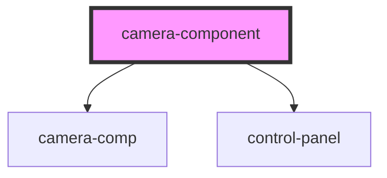

# camera-component

<!-- Auto Generated Below -->

## Properties

| Property                | Attribute               | Description | Type     | Default     |
| ----------------------- | ----------------------- | ----------- | -------- | ----------- |
| `background_color`      | `background_color`      |             | `string` | `undefined` |
| `debug`                 | `debug`                 |             | `string` | `undefined` |
| `disable_control_panel` | `disable_control_panel` |             | `string` | `undefined` |
| `face_detection`        | `face_detection`        |             | `string` | `undefined` |
| `logo_style`            | `logo_style`            |             | `string` | `undefined` |
| `model_path`            | `model_path`            |             | `string` | `undefined` |
| `probability_threshold` | `probability_threshold` |             | `string` | `undefined` |
| `show_mask`             | `show_mask`             |             | `string` | `undefined` |
| `stop_after_capturing`  | `stop_after_capturing`  |             | `string` | `undefined` |
| `url_logo`              | `url_logo`              |             | `string` | `undefined` |

## Dependencies

### Depends on

- [camera-comp](../Camera)
- [control-panel](../ControlPanel)

### Graph

----------------------------------------------

*Built with [StencilJS](https://stenciljs.com/)*
